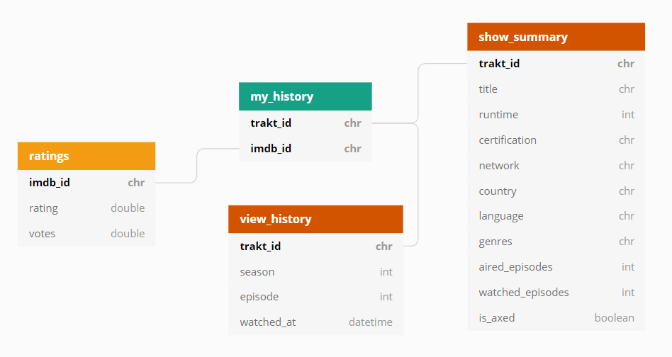

# My TV Viewing Habits
Personal term project for *Data Visualization 1: Introduction to Data Visualization with Tableau* in the 2019/20 Fall trimester @ CEU, Budapest.

#### Table of contents

- [Data sources and transformations](#data-sources-and-transformations)
- [Data model](#data-model)
- [Business questions and analysis goals](#business-questions-and-analysis-goals)

## Data sources and transformations

I used two separate datasets to create the underlying data that would feed the Tableau dashboard:
* Data extracts via the [tRakt](http://jemus42.github.io/tRakt/index.html) R package from [trakt.tv](http://trakt.tv/), which is a website that allows you to track the TV shows/movies that you've watched. I focused on TV shows, and I was able to pull my personal watch history, as well as supporting information (dimensions) about the TV shows.
* And the open-source title.ratings.tsv.gz dataset from [IMDb](https://www.imdb.com/interfaces/) (*downloaded on 11/01/2019*), containing ratings and number of votes per TV show.

Data pull and wrangling was performed via an [R script](get_trakt_data.R).

## Data model

#### `my_history`

| Field | Description |
| --- | --- |
| `trakt_id` :key: | Unique identifier of trakt items. |
| `imdb_id` :key: | Unique identifier of IMDb items. |

#### `view_history`

| Field | Description |
| --- | --- |
| `trakt_id` :key: | Unique identifier of trakt items. |
| `season` | Season of the TV show. |
| `episode` | Episode of the TV show within the season. |
| `watched_at` | The time when I marked the episode as "Watched" in trakt. |

#### `show_summary`

| Field | Description |
| --- | --- |
| `trakt_id` :key: | Unique identifier of trakt items. |
| `title` | Title of the TV show. |
| `runtime` | The length of an average episode. |
| `certification` | Certification of the show (e.g. TV-PG, TV-14) |
| `network` | The network where the TV show aired. |
| `country` | The country where the TV show aired. |
| `language` | The language of the TV show. |
| `genres` | Genres of a TV show, can be more than one. |
| `aired_episodes` | Number of episodes that have aired. |
| `watched_episodes` | Number of episodes I've marked as "Watched". |
| `is_axed` | Whether I'm still watching the show or not. |

A TV show is considered axed from my perspective if I haven't watched all episodes of the show, and I haven't watched any new episodes in the past 2 years.

#### `ratings`

| Field | Description |
| --- | --- |
| `imdb_id` :key: | Unique identifier of IMDb items. |
| `rating` | The average rating of the show on IMDb. |
| `votes` | Number of votes cast. |

## Business questions and analysis goals
